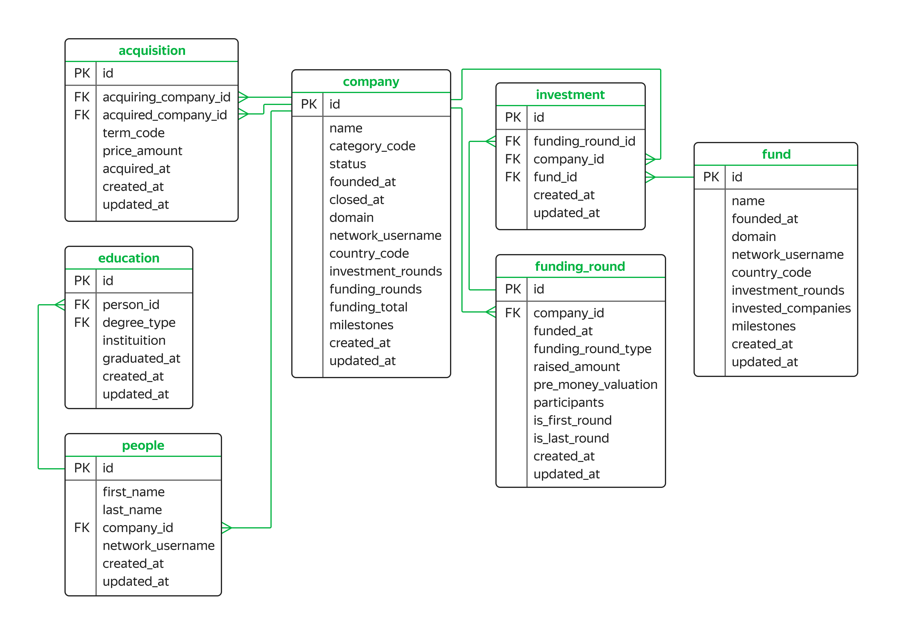

# Анализ данных о фондах и инвестициях

## Данные

## Задача

Составить сводную таблицу и выведите среднюю сумму инвестиций для стран, в которых есть стартапы, зарегистрированные в 2011, 2012 и 2013 годах. Данные за каждый год должны быть в отдельном поле. Отсортировать таблицу по среднему значению инвестиций за 2011 год от большего к меньшему.

## 

## Общий вывод

Мне удалось сформировать соответствующий запрос. В топ-3 за 2011 год по инвестициям оказались Перу, США и Гонконг.

## 

## Используемая СУБД
*PostgreSQL*